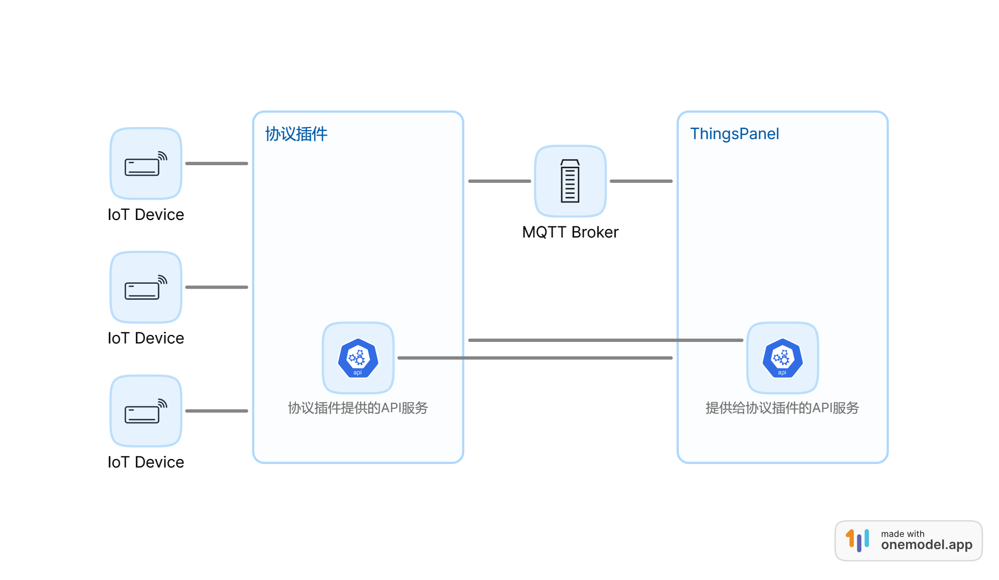
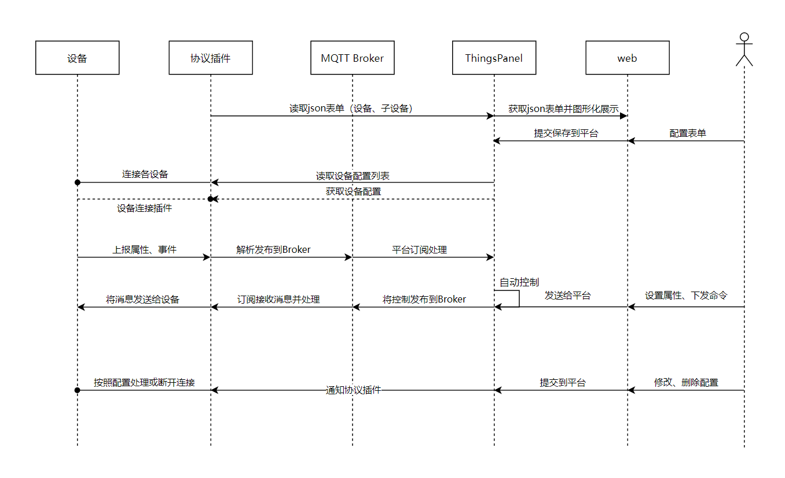

# modbus-protocol-plugin

设备是mqtt以外的协议除了可以从规则引擎接入，也可以开发协议插件服务接入到ThingsPanel

## 插件如何注册到平台
`手动注册`和`SQL导入`二选一
### 手动注册
1. 点击`应用管理`->`接入协议`->`注册插件`
2. 填入插件信息  
   **名称**：创建设备时，会显示在选择协议下拉框中  
   **设备类型**：必填，选网关  
   **接入地址**：插件服务的ip地址和端口（设备对接,作为平台中的提示信息，没有实际意义）  
   **HTTP服务地址**：插件服务的ip地址和端口（必填，供平台后端调用；如果modbus协议插件是用快速安装部署，这里要填插件协议容器的ip:172.19.0.8）  
   **插件订阅主题前缀**： （必填）
    | 名称           | 设备类型 | 协议类型   | 接入地址   | HTTP服务地址  | 插件订阅主题前缀 |
    | -------------- | -------- | ---------- | ---------- | ------------- | ---------------- |
    | MODBUS_TCP协议 | 网关设备 | MODBUS_TCP | 服务ip:502 | 127.0.0.1:503 | plugin/modbus/   |
    | MODBUS_RTU协议 | 网关设备 | MODBUS_RTU | 服务ip:502 | 127.0.0.1:503 | plugin/modbus/   |
### SQL导入
在数据库执行以下sql
```sql
INSERT INTO public.tp_protocol_plugin
(id, "name", protocol_type, access_address, http_address, sub_topic_prefix, created_at, description, device_type)
VALUES('c8a13166-e010-24e4-0565-e87feea162bb', 'MODBUS_TCP协议', 'MODBUS_TCP', '服务ip:502', '127.0.0.1:503', 'plugin/modbus/', 1668759820, '请参考文档对接设备', '2');
INSERT INTO public.tp_protocol_plugin
(id, "name", protocol_type, access_address, http_address, sub_topic_prefix, created_at, description, device_type)
VALUES('2a95000c-9c29-7aae-58b0-5202daf1546a', 'MODBUS_RTU协议', 'MODBUS_RTU', '服务ip:502', '127.0.0.1:503', 'plugin/modbus/', 1668759841, '请参考文档对接设备', '2');

INSERT INTO public.tp_dict
(id, dict_code, dict_value, "describe", created_at)
VALUES('8881ffe7-7c2b-43c2-13f3-7227dafa46bv', 'GATEWAY_PROTOCOL', 'MODBUS_TCP', 'MODBUS_TCP协议', 1669281289);
INSERT INTO public.tp_dict
(id, dict_code, dict_value, "describe", created_at)
VALUES('8881ffe7-7c2b-43c2-13f3-7227dafa46bs', 'GATEWAY_PROTOCOL', 'MODBUS_RTU', 'MODBUS_RTU协议', 1669281289);
```

## 结构图



## 时序图


## 如何开发

您需要开发一个服务程序，不管您以什么编程语言进行开发，实现以下规范内容就可以跟ThingsPanel平台对接
### SDK包
go语言有sdk包封装了下面两部分以及mqtt交互部分；包地址：https://github.com/ThingsPanel/tp-protocol-sdk-go
### plugin需要提供的接口
| 接口                      | 接口描述         | 接口链接                                                                                      |
| ------------------------- | ---------------- | --------------------------------------------------------------------------------------------- |
| /api/form/config          | 获取插件表单配置 | [传送](https://www.apifox.cn/apidoc/shared-34b48097-8c3a-4ffe-907e-12ff3c669936/api-43746721) |
| /api/device/config/update | 修改子设备配置   | [传送](https://www.apifox.cn/apidoc/shared-34b48097-8c3a-4ffe-907e-12ff3c669936/api-43903019) |
| /api/device/config/add    | 新增子设备配置   | [传送](https://www.apifox.cn/apidoc/shared-34b48097-8c3a-4ffe-907e-12ff3c669936/api-43925736) |
| /api/device/config/delete | 删除子设备配置   | [传送](https://www.apifox.cn/apidoc/shared-34b48097-8c3a-4ffe-907e-12ff3c669936/api-43965145) |

### thingspanel提供给插件的接口
| 接口                      | 接口描述                                                                                    | 接口链接                                                                                      |
| ------------------------- | ------------------------------------------------------------------------------------------- | --------------------------------------------------------------------------------------------- |
| /api/plugin/device/config | 设备连接时送来密钥，根据密钥获取插件相关设备的信息，"SubDevice"的属性时插件表单中定义的属性 | [传送](https://www.apifox.cn/apidoc/shared-34b48097-8c3a-4ffe-907e-12ff3c669936/api-43535958) |


## 插件表单

`./form_config.json`  （表单规则详情请参考modbus-protocol-plugin案例）
ThingsPanel前端通过`/api/form/config`接口获取表单配置，生成子设备的表单，用户填写的表单数据会出现在ThingsPanel提供的`/api/plugin/device/config`接口返回的数据中的"SubDevice"属性中。

## 具体开发规范可参考官方文档thingspanel.io中协议插件开发部分

