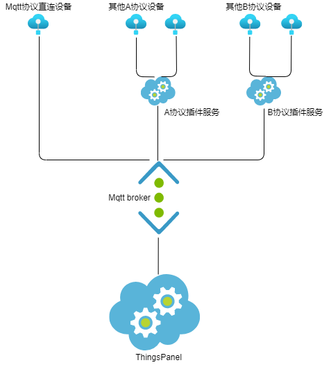

# modbus-protocol-plugin

设备是mqtt以外的协议除了可以从规则引擎接入，也可以开发协议插件服务接入到ThingsPanel

## 插件如何注册到平台
1. 点击`应用管理`->`接入协议`->`注册插件`
2. 填入插件信息  
   **名称**：创建设备时，会显示在选择协议下拉框中  
   **设备类型**：必填，选网关  
   **接入地址**：插件服务的ip地址和端口（设备对接,作为平台中的提示信息）  
   **HTTP服务地址**：插件服务的ip地址和端口（必填，供平台后端调用）  
   **插件订阅主题前缀**： （必填）
    |名称|设备类型|协议类型|接入地址|HTTP服务地址|插件订阅主题前缀|
    |----|--------|-------|---------|----------|-----------------|
    |MODBUS_TCP协议|网关设备|MODBUS_TCP|127.0.0.1:502|127.0.0.1:503|plugin/modbus/|
    |MODBUS_RTU协议|网关设备|MODBUS_RTU|127.0.0.1:502|127.0.0.1:503|plugin/modbus/|


## 结构图



## 如何开发

您需要开发一个服务程序，不管您以什么编程语言进行开发，实现以下规范内容就可以跟ThingsPanel平台对接

## plugin需要提供的接口
| 接口                          | 接口描述              |接口链接|
| ----------- | ---------- | ---------- |
| /api/form/config              | 获取插件表单配置      |[传送](https://www.apifox.cn/apidoc/shared-34b48097-8c3a-4ffe-907e-12ff3c669936/api-43746721) |
| /api/device/config/update     | 修改子设备配置        |[传送](https://www.apifox.cn/apidoc/shared-34b48097-8c3a-4ffe-907e-12ff3c669936/api-43903019)|
| /api/device/config/add        | 新增子设备配置        |[传送](https://www.apifox.cn/apidoc/shared-34b48097-8c3a-4ffe-907e-12ff3c669936/api-43925736)|
| /api/device/config/delete        | 删除子设备配置        |[传送](https://www.apifox.cn/apidoc/shared-34b48097-8c3a-4ffe-907e-12ff3c669936/api-43965145)|

## thingspanel提供给插件的接口
| 接口                          | 接口描述              |接口链接|
| ----------- | ---------- | ---------- |
| /api/plugin/device/config         | 设备连接时送来密钥，根据密钥获取插件相关设备的信息，"SubDevice"的属性时插件表单中定义的属性 | [传送](https://www.apifox.cn/apidoc/shared-34b48097-8c3a-4ffe-907e-12ff3c669936/api-43535958)      |


## 插件表单

`./form_config.json`  （表单规则详情请参考modbus-protocol-plugin案例）
ThingsPanel前端通过`/api/form/config`接口获取表单配置，生成子设备的表单，用户填写的表单数据会出现在ThingsPanel提供的`/api/plugin/device/config`接口返回的数据中的"SubDevice"属性中。

## 交换数据相关

### 插件推送数据到平台

设备对接到协议插件，协议插件处理设备端的消息后，将消息通过mqtt发给ThingsPanel平台

协议插件发送主题如下：

```text
mqtt用户：root  （使用thingspanel-go配置文件中的用户名和密码）
发布主题：device/attributes
报文规范：{"token":sub_device_token,"values":{key:value...}}
```

### 平台推送数据给插件

平台向设备发送消息需要通过协议插件，平台将消息通过mqtt发给协议插件

协议插件订阅主题如下：

```text
mqtt用户：root  （使用thingspanel-go配置文件中的用户名和密码）
订阅主题：plugin/modbus/# (说明：modbus为注册插件时填写的插件订阅主题名称,ThingsPanel平台发来主题#部分是sub_device_token)  
报文规范：{key:value...}
```

